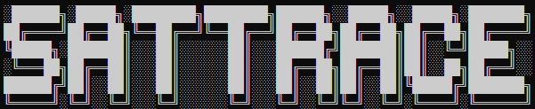
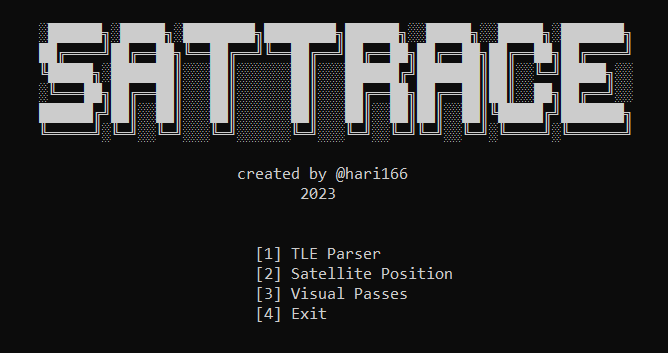

# SatTRACE
A CLI tool for real-time satellite tracking by utilizing API from [N2YO](https://www.n2yo.com/) and obtain various data, including a TLE parser, reconnaissance data, position tracker and more.

## Configure
1. [Register](https://www.n2yo.com/login/register/) on N2YO and obtain API key.
2. ```docker pull hari166/sattrace``` and start a container.
3. ```docker exec -it CONTAINER_ID sh```
4. Set API key as environment variable with ```export N2YO=API_KEY```.
5. Run ```go run .```

## Preview


## Features
- TLE for given satellite
- TLE parser
- Satellite position
- Visual passes

## Upcoming Updates
- Get visual passes with reference to user's location.

## Reference
- [What is TLE?](http://www.satobs.org/element.html)
- [Golang Official Documentation](https://go.dev/doc/)